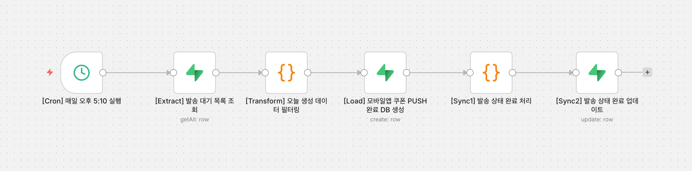

# 🥐 뚜레쥬르 : Zero Waste AI
> **AI 폐기 예측 모델 기반의 실시간 초개인화 마케팅 통합 솔루션**

---

## 1. Zero Waste AI 시스템 구조 (System Architecture)
본 프로젝트는 매장 운영부터 고객 접점까지 하나로 연결된 **4단계 통합 아키텍처**로 설계되었습니다.

* **점포경영시스템 (Local)**: 실시간 재고 및 판매 데이터를 생성하고 관리하는 데이터의 원천.
* **중앙 데이터 허브 (Supabase DB)**: 전체 시스템의 '중앙 서버' 역할을 수행합니다. 실제 운영 데이터 접근 권한이 없는 환경을 고려하여, 담당자 인터뷰 기반의 비즈니스 로직을 반영한 데이터 세트를 구축하고 모든 시스템 구성 요소가 공유하는 실시간 저장소로 활용했습니다.
* **CJOneFlow 폐기율 예측 Custom API (Central)**: 예측 모델과 폐기율 산출 로직이 탑재된 시스템의 '두뇌' 역할.
* **뚜레쥬르 모바일 앱 (Mobile)**: AI 분석 결과를 기반으로 고객에게 실시간 혜택을 전달하는 채널.

---

## 2. 데이터 파이프라인 및 핵심 기술 (Data Flow)
데이터가 흐르는 순서에 따라 각 단계에 적용된 핵심 기술 상세입니다.

### ① 데이터 분석 및 예측 단계 (Analysis)
* **판매량 예측 모델 (Random Forest)**: 13가지 환경 변수(날씨, 요일 등)를 계산하여 비선형적인 수요를 정밀하게 예측합니다.
* **매장 클러스터링 (K-Means)**: 전국 매장을 상권별 5개 그룹으로 분류하여 학습 효율과 예측 정확도를 극대화했습니다.
* **폐기율(EWR) 산출**: 예측된 수요를 바탕으로 실시간 폐기 리스크를 계산합니다.
    $$EWR = \frac{\text{현재 재고} - \sum \text{예상 판매량}}{\text{당일 총 생산량}} \times 100$$

### ② 마케팅 자동화 단계 (Automation)
* **지능형 마케팅 트리거**: AI 모델이 도출한 예상 폐기율(EWR)이 **12%를 초과**하는 즉시 시스템이 마케팅 필요 상황으로 판단하여 `push_queue` 테이블에 `pending` 상태로 데이터를 적재하며 프로세스를 트리거합니다.
* **LLM 프롬프트 엔지니어링 및 JSON 구조화**:
    * **Contextual Hooking**: 폐기 고위험 상품을 미끼 상품(Hook)으로 활용하여 고객의 식욕을 자극하는 개인화 문구를 생성합니다.
    * **JSON Mode 적용**: LLM 출력을 Headline, Push Text, Action Line으로 구성된 **엄격한 JSON 스키마**로 강제하여 프론트엔드 파싱 오류를 원천 차단했습니다.
    * **Negative Prompting**: 브랜드 이미지 보호를 위해 '폐기', '재고 처리' 등 부정적인 단어 노출을 기술적으로 제한했습니다.
* **n8n 오케스트레이션 및 데이터 정합성**:
    
    * **정밀 배치 처리**: 매일 17:00~17:30 사이 마감 할인 골든타임에 맞춰 수백 건의 데이터를 지연 없이 처리합니다.
    * **멱등성 확보**: 발송 완료 즉시 원본 데이터의 상태를 `sent`로 업데이트하여 **중복 발송을 방지**하는 상태 관리 로직을 구현했습니다.
* **장애 대응 시스템 (Fallback)**: LLM API 오류나 네트워크 지연 발생 시 시스템 중단을 방지하기 위해 사전에 정의된 **고정 마케팅 템플릿**이 자동으로 작동하는 예외 처리 파이프라인을 구축했습니다.

### ③ 실시간 할인 혜택 전달 단계 (Delivery)
* **Supabase Realtime**: WebSocket 기술을 통해 DB의 변화(event:insert)를 감지, 앱 새로고침 없이 고객 화면에 알림을 즉시 노출합니다.
* **Interactive UX**: 점주는 대시보드에서 분석 결과를 확인하고, 고객은 앱에서 당일 한정 쿠폰을 수령합니다.

---

## 3. 핵심 구현 성과 (Technical Implementation)

### 현업 로직 기반의 ML 모델링 및 정교화
* **수요 예측 로직 이식**: 기존의 단순 통계를 넘어 실제 점포 운영 노하우를 **Feature Engineering**에 반영, 비선형적 변수(날씨, 이벤트 등)에 강한 Random Forest 모델을 구축하여 높은 신뢰도를 확보했습니다.

### 서빙 관제 및 실시간 로그 모니터링 (Monitoring)
* **Serving Monitoring**: **CJOneflow Serving Monitoring**을 도입하여 모델의 인퍼런스 상태, 호출 빈도, 응답 속도를 실시간으로 관제합니다.
* **Log-level Debugging**: API 호출 시 발생하는 상태 코드와 실행 로그를 추적하여 비정상 데이터 인입 시 즉각적인 트러블슈팅이 가능한 안정적인 운영 환경을 구축했습니다.

### FastAPI 기반 고성능 비동기 아키텍처
* **I/O 최적화**: 다수의 외부 API 통신 시 발생하는 대기 시간을 최소화하기 위해 **Async/Await** 구조를 전면 채택하여, 인프라 제한 시간(300s) 내에 모든 프로세스가 안정적으로 완결되도록 설계했습니다.

---

## 4. 기대 효과 및 비전
* **손익 개선**: 데이터 기반의 정교한 재고 관리로 폐기 손실을 이익으로 전환.
* **고객 경험(CX) 혁신**: "매일"을 넘어 "당신(Yours)"을 위한 초개인화된 브랜드 가치 전달.
* **AX 표준 정립**: 가상 점포 환경에서 검증된 시스템을 통해 글로벌 매장 확장 시 즉시 적용 가능한 디지털 표준 모델 확보.